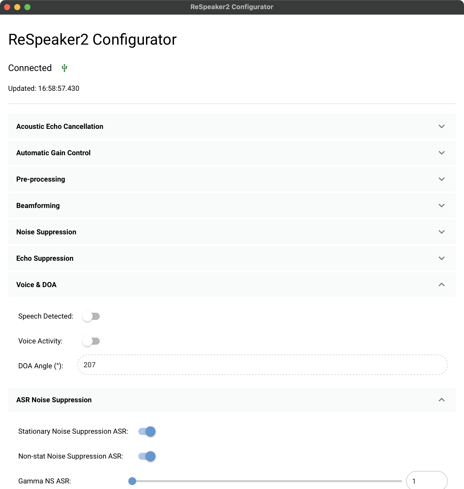

# ReSpeaker2 Configurator

A simple GUI application to configure
the [ReSpeaker Mic Array v2.0](https://wiki.seeedstudio.com/ReSpeaker_Mic_Array_v2.0/).

This tool allows you to easily connect to your ReSpeaker device, view its status, and adjust its configuration
parameters through an intuitive interface.



## Features

- Connects to the ReSpeaker Mic Array v2.0 via USB
- Displays connection status and device information
- Allows configuration of device parameters through a user-friendly GUI

## Installation

1. **Clone the repository:**
   ```sh
   git clone https://github.com/cansik/respeaker2-configurator.git
   cd respeaker2-configurator
   ```

2. **Install dependencies (Python 3.12+ required):**
   ```sh
   pip install uv # if not already installed
   uv sync
   ```

   Or for development:
   ```sh
   uv sync --dev
   ```

## Usage

Simply run the application with:

```sh
uv run python main.py
```

This will launch the GUI. Make sure your ReSpeaker Mic Array v2.0 is connected via USB.

---

**Note:**  
If you encounter any issues, please ensure your Python version is 3.12 or higher and that all dependencies are installed.